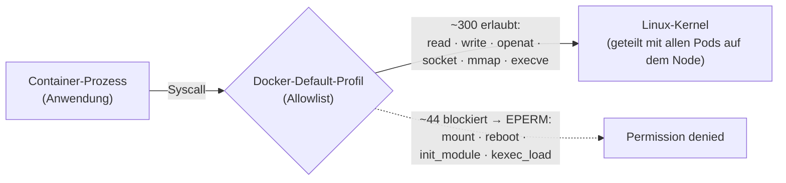
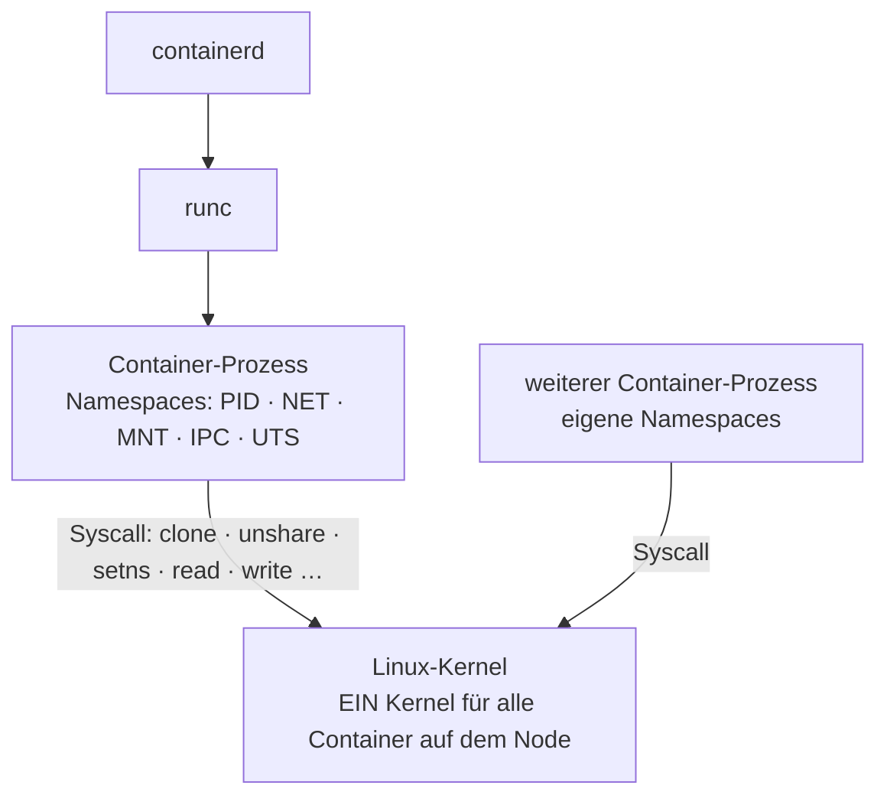

## Das Problem: Der Kernel, Container und Kubernetes - Wie hängt was zusammen?
Bei meinen Trainings kommt früher oder später die Frage: Wenn der Container
doch isoliert ist - wieso kann er den Kernel vom Host überhaupt anfassen? Bzw. warum ist dann Kernel-Hardening so wichtig?

Die kurze Antwort: Der Container teilt sich den Kernel mit dem Host, und der
einzige Draht dorthin sind Syscalls. Genau da liegt das Problem, um das es
diesmal geht.

Ganz wichtig vorweg: Wir schauen uns hier drei Dinge an - `Syscalls`,
das `seccomp-Default-Profile` und `Namespaces`. Alles andere - Capabilities, AppArmor, Pod
Security Standards usw. kommt Stück für Stück in den nächsten Posts. Eins nach dem
anderen, sonst wird aus dem Post noch ein Buch.
## Grundlagen: Ein Kernel, ~350 Syscalls Aktionen und wer passt auf?

Fangen wir mit der Aktion an. Ein **Systemaufruf** (Syscall) ist der direkte
Befehl an das Betriebs (genauer den Kernel), eine bestimmte Aktion durchzuführen (z.B. eine
Datei öffnen, einen Netzwerk-Socket erstellen, Speicher anfordern). Damit fragt der Userspace und der Kernel macht ([Quelle: syscalls(2)](https://man7.org/linux/man-pages/man2/syscalls.2.html)). 

Mein Prozess `tolleApp` möchte z.B. ein Verzeichnis erstellen - Syscall [`mkdirat`](https://man7.org/linux/man-pages/man2/mkdir.2.html) und fragt daher den Kernel. Wie viele dieser Aktionen bzw. Syscalls es gibt, hängt von Architektur und Kernelversion ab. Für
x86-64 liegt die Syscall-Tabelle aktuell in der Größenordnung von rund 350+
Einträgen, wobei einige Plätze reserviert oder gar nicht implementiert sind. Die
laufende Referenz ist die aus dem Kernel-Quelltext (`syscall_64.tbl`) abgeleitete
[Syscall-Tabelle für x86-64](https://filippo.io/linux-syscall-table/) - da kannst
Du nachschauen, was es genau gibt. Ein typisches `containerd-` bzw.
`Docker-Default`-Profil blockt davon etwa 44
([Quelle: systemshardening](https://www.systemshardening.com/articles/linux/linux-container-runtime-alternatives/));
das offizielle `Docker-Default-Profile`
[deaktiviert rund 44 von 300+ Syscalls](https://docs.docker.com/engine/security/seccomp/).
Der Rest - über 300 - bleibt erreichbar. Aber in Kubernetes wird doch `containerd` genutzt. Hierfür gibt es auch eine 

Und hier wird es für Kubernetes interessant. Jeder Container unter `runc` teilt
sich den Kernel vom Host der Control-Plane/Worker-Node. Die Namespace- und cgroup-Schicht verbirgt Ressourcen vor
dem Container-Prozess, dazu später etwas weiter unten. Aber der Prozess redet direkt über Syscalls mit dem Kernel
([Quelle: systemshardening](https://www.systemshardening.com/articles/linux/linux-container-runtime-alternatives/)).
Es gibt keine Übersetzungsschicht, keinen Hypervisor dazwischen. Der Kernel, den
Dein Pod anspricht, ist derselbe Kernel, auf dem alle anderen Pods desselben
Nodes laufen.

Vereinfacht sieht der Weg eines Syscalls durch das Default-Profil so aus:



## Seccomp: Der Türsteher vor dem Kernel

Der Filter aus dem Bild oben hat einen Namen: **seccomp** (secure computing
mode). Das ist ein Kernel-Feature, das es schon seit Version 2.6.12 gibt, und es
schränkt ein, welche Syscalls ein Prozess aus dem Userspace überhaupt absetzen
darf ([Quelle: Kubernetes](https://kubernetes.io/docs/tutorials/security/seccomp/)).

Ein **seccomp-Profil** ist technisch eine JSON-Datei nach dem Schema der
OCI-Runtime-Spezifikation: Es legt eine Default-Aktion fest, überschreibt sie für
einzelne Syscalls und kann sogar auf konkrete Argument-Werte matchen
([Quelle: Kubernetes](https://kubernetes.io/docs/reference/node/seccomp/)). Das
Default-Profil der Container-Runtimes ist eine **Allowlist**: Default ist
`SCMP_ACT_ERRNO` — „verbieten, mit Permission denied" — und nur eine Liste
bekannter, ungefährlicher Syscalls wird auf `SCMP_ACT_ALLOW` gesetzt
([Quelle: Docker](https://docs.docker.com/engine/security/seccomp/)). Unter der
Haube läuft das als BPF-Filter, der jeden Syscall gegen diese Liste prüft und so
die Angriffsfläche verkleinert
([Quelle: systemshardening](https://www.systemshardening.com/articles/linux/linux-container-runtime-alternatives/)).

Klingt nach solider Grundsicherung. Ist es auch — aber mit drei Haken, und die
sind der eigentliche Grund für diesen Abschnitt.

**Erstens: In Kubernetes ist seccomp per Default oft gar nicht an.** Die Runtime
*hätte* ihr Default-Profil, aber ohne weiteres Zutun fährt der Pod `Unconfined`
— also ganz ohne Filter. Erst wenn Du pro Pod `seccompProfile: RuntimeDefault`
setzt oder am Kubelet `seccompDefault` aktivierst, greift das Default-Profil;
sonst ist der Default `Unconfined`
([Quelle: Kubernetes](https://kubernetes.io/docs/reference/node/seccomp/)). Ob in
einem Pod überhaupt ein Filter aktiv ist, siehst Du so:

```bash
kubectl exec <pod> -- grep Seccomp /proc/1/status
# Seccomp:	0   -> kein Filter (Unconfined)
# Seccomp:	2   -> Filter aktiv
```

Wie man `RuntimeDefault` clusterweit erzwingt, ist Thema für einen eigenen Post.

**Zweitens: Bei `privileged: true` greift seccomp nie.** Egal, was im Manifest
steht — privilegierte Container laufen immer `Unconfined`
([Quelle: Kubernetes](https://kubernetes.io/docs/tutorials/security/seccomp/)).
Den Beweis liefere ich weiter unten im eigenen Abschnitt.

**Drittens — der subtile Haken: Seccomp filtert, *welche* Syscalls benutzt
werden, nicht *was* sie anrichten.** Ein erlaubter Syscall bleibt erlaubt, auch
wenn er missbraucht wird. Syscall-Filterung verkleinert die Angriffsfläche, sie
beseitigt den Angriffsweg nicht
([Quelle: systemshardening](https://www.systemshardening.com/articles/linux/linux-container-runtime-alternatives/)).
Über 300 Syscalls bleiben offen — und der unangenehme Teil: Sowohl Dirty Pipe
(CVE-2022-0847) als auch Copy Fail nutzten mit `splice` einen Syscall, den das
Default-Profil gar nicht blockt. Der Filter sah tatenlos zu.

Und damit zu **root**. Seccomp ändert nicht, *wer* Du im Container bist und
*welche* Capabilities Du hältst. Läuft der Container als `root` (UID 0) — ohne
User-Namespace der Default, dazu gleich mehr —, dann ist dieser root derselbe wie
auf dem Host: Bei einem Ausbruch wärst Du root auf dem Node
([Quelle: Dynatrace](https://www.dynatrace.com/news/blog/kubernetes-security-best-practices-security-context/)).
Dazu kommen die Default-Capabilities, die der Container ohnehin mitbringt (dazu
mehr im nächsten Post). Viele heikle Operationen hängen an genau diesen
Capabilities, nicht an seccomp — steht der Syscall auf der Allowlist und ist die
Capability vorhanden, lässt der Filter ihn durch.

Die Konsequenz ist unaufgeregt: seccomp ist ein Baustein, kein Schutzschild. Es
wirkt erst zusammen mit `runAsNonRoot: true`, gedroppten Capabilities und — wo
nötig — einem User-Namespace. Allein, und erst recht mit root im Container, ist
es dünn.

## Namespaces: Was der Container nicht sieht

Wenn Syscalls die Aktion sind, sind Namespaces die Umgebung. Ein **Namespace**
schränkt ein, welche globalen Systemressourcen ein Prozess (oder eine Gruppe von
Prozessen) überhaupt sieht
([Quelle: namespaces(7)](https://man7.org/linux/man-pages/man7/namespaces.7.html)).

Der Kernel kennt aktuell acht Typen, jeder mit eigenem `CLONE_*`-Flag:

- **PID** (`CLONE_NEWPID`) — Prozess-IDs
- **Network** (`CLONE_NEWNET`) — Netzwerkgeräte, Stacks, Ports
- **Mount** (`CLONE_NEWNS`) — Mount-Points
- **IPC** (`CLONE_NEWIPC`) — System-V-IPC, POSIX Message Queues
- **UTS** (`CLONE_NEWUTS`) — Hostname und NIS-Domain
- **User** (`CLONE_NEWUSER`) — User- und Group-IDs
- **Cgroup** (`CLONE_NEWCGROUP`) — Cgroup-Root-Verzeichnis
- **Time** (`CLONE_NEWTIME`) — Boot- und Monotonic-Clock

Wovon legt containerd per Default welche an? Fünf: **PID, IPC, UTS, Mount und
Network** ([Quelle: containerd `oci/spec.go`](https://github.com/containerd/containerd/blob/v1.4.0/oci/spec.go)).
Auffällig ist, was fehlt: der **User-Namespace** ist standardmäßig nicht dabei.
Heißt im Klartext — der `root` (UID 0) in Deinem Container ist derselbe `root`
wie auf dem Host. Erst ein eigens aktivierter User-Namespace mappt die
Container-UIDs auf andere Host-UIDs; die CRI kann das inzwischen,
[braucht dafür aber runc 1.2.0 oder neuer](https://github.com/containerd/containerd/blob/main/docs/containerd-2.0.md).

Namespaces sind kein Hexenwerk, sondern werden über Syscalls erzeugt und betreten
— schön zu sehen, wie eng Syscalls und Namespaces zusammenhängen:

- `clone()` erstellt einen neuen Prozess und legt direkt fest, in welche neuen
  oder bestehenden Namespaces er aufgenommen wird.
- `unshare()` trennt den aktuellen Prozess von einem oder mehreren Namespaces
  und schiebt ihn in einen neuen, isolierten Bereich.
- `setns()` lässt einen Prozess in einen bereits bestehenden Namespace wechseln —
  genau das passiert beim Debugging mit `nsenter`.

([Quelle: namespaces(7)](https://man7.org/linux/man-pages/man7/namespaces.7.html);
zum Vertiefen für Netzwerk-Namespaces das
[Linux-Magazin](https://www.linux-magazin.de/ausgaben/2016/06/network-namespaces/))

Im Bild: containerd reicht über runc den Prozess in seine Namespaces, und am Ende
landet trotzdem jeder Syscall bei demselben einen Kernel.



Genug Theorie, schauen wir rein. Welche Namespaces hat ein frischer Pod?

```bash
kubectl run nstest --image=busybox --restart=Never -it --rm -- \
  sh -c 'ls -l /proc/1/ns'
```

Du bekommst eine Liste von Handles — je ein symbolischer Link pro Namespace, den
der Prozess bewohnt (`mnt`, `net`, `pid`, `ipc`, `uts` …). Jeder Link zeigt auf
eine Inode-Nummer wie `pid:[4026531836]`; teilen sich zwei Prozesse dieselbe
Nummer, sind sie im selben Namespace. Auf einem Node siehst Du mit `lsns`
dieselbe Maschine, viele Namespaces nebeneinander — und genau einen Kernel
darunter.

## Was passiert bei privileged: true?

Damit klar wird, wofür die ganze Isolation gut ist, dreht man sie am besten
einmal ab. Genau das macht `privileged: true` im `securityContext`.

Ein privilegierter Container bekommt das **komplette Capability-Set**,
**Zugriff auf die Geräte des Hosts** und läuft **ohne seccomp- und ohne
AppArmor-Confinement**. Er hat damit praktisch denselben Zugriff auf den Host wie
ein Prozess direkt auf dem Host
([Quelle: protsenko.dev](https://protsenko.dev/kubernetes-security-top-12-best-practices-to-protect-your-cluster/)).
Die Allowlist aus dem ersten Abschnitt? Weg. Die ~44 blockierten Syscalls? Wieder
erreichbar. In der Kubernetes-Doku steht das nüchtern: Auf einen Container mit
`privileged: true` lässt sich kein seccomp-Profil anwenden, privilegierte
Container laufen immer als `Unconfined`
([Quelle: Kubernetes](https://kubernetes.io/docs/tutorials/security/seccomp/)).

Wichtig zur Einordnung, weil das gern durcheinandergeht: `privileged: true` teilt
**nicht** automatisch die Namespaces des Hosts. PID, Netzwerk und IPC des Hosts
bekommt der Pod erst mit `hostPID`, `hostNetwork`, `hostIPC` — das sind eigene
Schalter. Die Namespace-Isolation bleibt also zunächst bestehen. Nur nützt sie
wenig: Mit allen Capabilities und Zugriff auf die Host-Devices ist der Weg aus
dem Container heraus eine Formsache. Ein privilegierter Container ist praktisch
ein Host-Prozess mit Root-Rechten.

Das lässt sich in wenigen Zeilen zeigen. Ein Pod, der ausdrücklich
`RuntimeDefault` anfordert — und trotzdem privilegiert läuft:

```yaml
apiVersion: v1
kind: Pod
metadata:
  name: priv-test
spec:
  containers:
    - name: app
      image: alpine
      command: ["sleep", "3600"]
      securityContext:
        privileged: true
        seccompProfile:
          type: RuntimeDefault
```

```bash
kubectl exec priv-test -- grep Seccomp /proc/1/status
# Seccomp:	0
```

`Seccomp: 0` heißt: kein Filter. Das `RuntimeDefault` im Manifest wurde
stillschweigend ausgehebelt
([Quelle: cloudsecburrito](https://cloudsecburrito.com/seccomp-in-kubernetes)).
Zum Vergleich — derselbe Pod ohne `privileged` und mit `RuntimeDefault` zeigt
`Seccomp: 2`, also aktive Filterung.

Bei meinen Trainings zeige ich an dieser Stelle gern, wie aus genau so einem
privilegierten Pod der Host übernommen wird. Dass das auch **ohne** Privilegien
geht — kein `privileged`, kein Host-Mount, nicht mal Root —, ist eine andere
Geschichte; die habe ich im Post zu
[Copy Fail (CVE-2026-31431)](https://zahlenhelfer.github.io/2026/05/19/copyfail-cve-2026-31431-kubernetes/)
auseinandergenommen.

## Was hat der Grundschutz damit zu tun?

Kurzer Blick über den Tellerrand, weil das Thema direkt in den IT-Grundschutz
reinläuft. Der frühere Sammel-Baustein ist heute aufgeteilt: **SYS.1.6
Containerisierung** deckt die Container und ihre Runtimes ab, **APP.4.4
Kubernetes** das Management des Container-Betriebs. Zusammen sind das 27 bzw. 21
Anforderungen
([Quelle: heise](https://www.heise.de/hintergrund/IT-Grundschutz-BSI-Anforderungen-fuer-Container-und-Kubernetes-6200393.html)).

Drei Bezüge zu dem, was wir hier gesehen haben:

- **Isolation ist nicht geschenkt.** SYS.1.6 beschreibt die Container-Trennung
  als Härtungsmechanismus, der nur trägt, wenn Containertechnik **und**
  Konfiguration passen
  ([Quelle: BSI SYS.1.6](https://www.bsi.bund.de/SharedDocs/Downloads/DE/BSI/Grundschutz/IT-GS-Kompendium_Einzel_PDFs_2023/07_SYS_IT_Systeme/SYS_1_6_Containerisierung_Edition_2023.pdf?__blob=publicationFile&v=4)).
  Das ist exakt die These dieses Posts: Namespaces verstecken, der Kernel bleibt
  geteilt — Sicherheit entsteht erst durch die Konfiguration obendrauf.
- **Keine privilegierten Container.** SYS.1.6 fordert, Anwendungsdienste nur
  unter einem nicht privilegierten Account und ohne erweiterte Privilegien zu
  starten
  ([Quelle: BSI SYS.1.6](https://www.bsi.bund.de/SharedDocs/Downloads/DE/BSI/Grundschutz/IT-GS-Kompendium_Einzel_PDFs_2023/07_SYS_IT_Systeme/SYS_1_6_Containerisierung_Edition_2023.pdf?__blob=publicationFile&v=4)).
  Genau der `privileged: true`-Schalter von oben.
- **Node- und Kernel-Härtung.** Bei APP.4.4 beziehen sich fast alle erhöhten
  Anforderungen auf die Sicherheit der Nodes
  ([Quelle: heise](https://www.heise.de/hintergrund/IT-Grundschutz-BSI-Anforderungen-fuer-Container-und-Kubernetes-6200393.html))
  — also auf den geteilten Kernel. Wie konkret das wird, wenn ein Kernel-Bug
  durchschlägt, steht im
  [Copy-Fail-Post](https://zahlenhelfer.github.io/2026/05/19/copyfail-cve-2026-31431-kubernetes/)
  (Stichwort APP.4.4.A8, Härtung des Linux-Kernels auf den Nodes).

## Fazit und Ausblick

Was bleibt hängen:

1. Container und Host teilen sich **einen** Kernel. Es gibt keinen Hypervisor
   dazwischen.
2. Der einzige Draht dorthin sind **Syscalls** — rund 350 Türen.
3. **Seccomp** filtert, *welche* Syscalls ein Prozess nutzen darf — nicht, was
   ein erlaubter Syscall anrichtet. In Kubernetes ist es per Default oft gar
   nicht aktiv, bei `privileged: true` nie.
4. **Namespaces** regeln, was ein Prozess sieht, nicht was er darf. Ohne
   User-Namespace ist root im Container derselbe root wie auf dem Host.
5. Die containerd-Defaults sind eine Grundlinie, keine Festung. Und
   `privileged: true` wirft selbst diese Grundlinie weg.

Im nächsten Post nehme ich mir die **Capabilities** vor: die vierzehn, die ein
Container per Default bekommt, was die einzeln dürfen, und warum
`drop: ["ALL"]` plus gezieltes Nachlegen fast immer die bessere Wahl ist.

Denkt mal für Euch durch, was in Euren Clustern eigentlich noch `privileged`
läuft — und ob es das wirklich braucht.

---

**Quellen und Weiterlesen:**

- [syscalls(2) — Linux manual page](https://man7.org/linux/man-pages/man2/syscalls.2.html)
- [namespaces(7) — Linux manual page](https://man7.org/linux/man-pages/man7/namespaces.7.html)
- [Searchable Linux Syscall Table for x86-64](https://filippo.io/linux-syscall-table/)
- [Docker — Seccomp security profiles](https://docs.docker.com/engine/security/seccomp/)
- [systemshardening — Linux Container Runtime Alternatives](https://www.systemshardening.com/articles/linux/linux-container-runtime-alternatives/)
- [containerd — oci/spec.go (Default-Capabilities und -Namespaces)](https://github.com/containerd/containerd/blob/v1.4.0/oci/spec.go)
- [containerd 2.0 — User-Namespaces in der CRI](https://github.com/containerd/containerd/blob/main/docs/containerd-2.0.md)
- [Kubernetes — Restrict a Container's Syscalls with seccomp](https://kubernetes.io/docs/tutorials/security/seccomp/)
- [Kubernetes — Seccomp und Kubernetes (Node-Referenz)](https://kubernetes.io/docs/reference/node/seccomp/)
- [Dynatrace — Kubernetes Security Best Practices: Security Context](https://www.dynatrace.com/news/blog/kubernetes-security-best-practices-security-context/)
- [Linux-Magazin — Network Namespaces](https://www.linux-magazin.de/ausgaben/2016/06/network-namespaces/)
- [BSI — SYS.1.6 Containerisierung (Edition 2023)](https://www.bsi.bund.de/SharedDocs/Downloads/DE/BSI/Grundschutz/IT-GS-Kompendium_Einzel_PDFs_2023/07_SYS_IT_Systeme/SYS_1_6_Containerisierung_Edition_2023.pdf?__blob=publicationFile&v=4)
- [heise — IT-Grundschutz: BSI-Anforderungen für Container und Kubernetes](https://www.heise.de/hintergrund/IT-Grundschutz-BSI-Anforderungen-fuer-Container-und-Kubernetes-6200393.html)
- [Copy Fail (CVE-2026-31431) — Wenn ein unprivilegierter Pod den Host rootet](https://zahlenhelfer.github.io/2026/05/19/copyfail-cve-2026-31431-kubernetes/)
