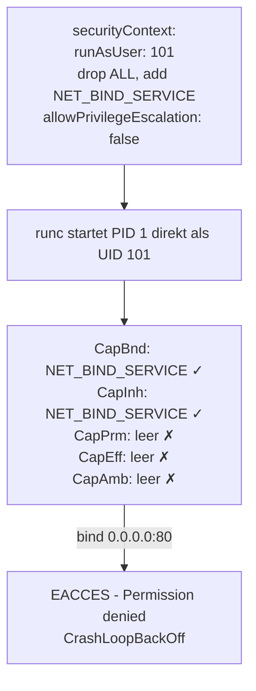

Im letzten Post zu [Kernel, Container und Kubernetes](https://zahlenhelfer.github.io/2026/06/04/kernel-container-kubernetes-die-herausforderung.html) habe ich am Ende einen kleinen Cliffhänger eingebaut: seccomp filtert, *welche* Syscalls ein Prozess absetzen darf - rund 44 sind im containerd-Default-Profil hart gesperrt, gut 300 bleiben offen. Aber "offen" ist nicht dasselbe wie "funktioniert".

Denn von den erlaubten Syscalls sind im Default-Profil **47 nur dann freigeschaltet, wenn der Prozess die passende Capability hält**. Sie sind nicht hart verboten, sondern *Capability-gated*. Und genau das ist das Thema diesmal: Was Capabilities sind, welche vierzehn davon containerd jedem Container schenkt, und warum der `nginx`-User im offiziellen Image existiert - und trotzdem noch als `root` gestartet wird, leider!

> DISCLAIMER: Ich bin weder Auditor noch Anwalt - daher keine Gewähr! Der Grundschutz-Abschnitt weiter unten ist mein Lese-Eindruck aus den Bausteinen, kein Audit-Statement.

## Das Problem: Unterschied zwischen "darf den Syscall" und "darf die Aktion" machen

Bei meinen Trainings kommt an dieser Stelle fast immer dieselbe Rückfrage: Wenn der Container eh als `root` läuft - wozu dann noch der ganze Capability-"Kram"?

Die kurze Antwort: Weil `root` im Container längst nicht mehr der Allmächtige ist, für den ihn alle halten. Seit Kernel 2.2 ist die Macht von UID 0 in einzelne **Capabilities** zerlegt - kleine, abgegrenzte Privilegien, die man einzeln vergeben oder entziehen kann ([Quelle: capabilities(7)](https://man7.org/linux/man-pages/man7/capabilities.7.html)). Statt "root oder nicht root" gibt es heute gut 40 dieser Einzelrechte. Ein paar, die gleich wichtig werden:

- `CAP_NET_BIND_SERVICE` - an Ports unter 1024 binden
- `CAP_NET_RAW` - Raw- und Packet-Sockets (Ping, aber auch ARP- und DNS-Spoofing im Pod-Netz)
- `CAP_CHOWN` - Eigentümer beliebiger Dateien ändern
- `CAP_SYS_ADMIN` - der Sammelbegriff für "fast alles", das neue `root`

Ein Prozess kann eine einzelne Capability halten, ***ohne*** `root` zu sein. Und umgekehrt kann man `root` Capabilities wegnehmen. Das ist der Hebel für "least privilege" im Container - und der Grund, warum der naive Reflex "dann halt als root" genau das Gegenteil von Härtung ist.

## Die glorreichen vierzehn: Was containerd jedem Container schenkt

Startest Du einen Container, vergibt containerd nicht etwa alle Capabilities oder keine, sondern einen festen `Default-Satz`. Es sind **vierzehn**, nachzulesen in `defaultUnixCaps()`([Quelle: containerd `pkg/oci/spec.go`](https://github.com/containerd/containerd/blob/main/pkg/oci/spec.go)):

```text
CAP_CHOWN            CAP_SETGID           CAP_NET_BIND_SERVICE
CAP_DAC_OVERRIDE     CAP_SETUID           CAP_SYS_CHROOT
CAP_FSETID           CAP_SETFCAP          CAP_KILL
CAP_FOWNER           CAP_SETPCAP          CAP_AUDIT_WRITE
CAP_MKNOD            CAP_NET_RAW
```

Zwei davon merken wir uns. `CAP_NET_RAW` ist drin - deshalb kann ein frischer Pod ohne Zutun pingen, aber eben auch ARP-Spoofing im Pod-Netz versuchen; viele Härtungs-Guides droppen es aus genau diesem Grund. Und `CAP_NET_BIND_SERVICE` ist drin - merk Dir das, es ist gleich der Dreh- und Angelpunkt beim nginx-Beispiel.

So weit die Capabilities, die der Prozess *mitbringt*. Jetzt zum Cliffhanger aus dem letzten Post: Das Default-**seccomp**-Profil von containerd ist nämlich nicht statisch. Es schaltet eine Reihe von Syscalls **nur dann** frei, wenn die zugehörige Capability im Bounding-Set des Prozesses liegt([Quelle: containerd `contrib/seccomp/seccomp_default.go`](<https://github.com/containerd/containerd/blob/main/contrib/seccomp/seccomp_default> go)). Ein paar Beispiele aus genau dieser Datei:

- `CAP_SYS_ADMIN` schaltet `mount`, `umount2`, `setns`, `unshare`, `bpf`,
  `mount_setattr`, `perf_event_open` und 16 weitere frei - allein 23 Syscalls
- `CAP_SYS_PTRACE` schaltet `ptrace`, `process_vm_readv`, `process_vm_writev`, `pidfd_getfd` und zwei weitere frei
- `CAP_SYS_MODULE` schaltet `init_module`, `finit_module`, `delete_module` frei
- `CAP_SYS_TIME` schaltet `clock_settime`, `settimeofday` und zwei weitere frei

Zählt man alle diese Blöcke zusammen, kommt man auf 50 Einträge. `bpf`, `syslog` und `perf_event_open` stehen jeweils zweimal drin (einmal unter `CAP_SYS_ADMIN`, einmal unter ihrer eigenen Capability), also bleiben ***47  Syscalls***, die das Default-Profil hinter eine Capability klemmt. Das ist die Zahl aus dem Cliffhanger - und sie steht so im Quelltext, nicht in einem Blogpost.

Der Punkt dahinter ist wichtiger als die Zahl: seccomp und Capabilities greifen ineinander. Für diese 47 Syscalls brauchst Du **beides** - der Syscall muss durch seccomp erlaubt sein, *und* Du musst die passende Capability halten. Fehlt die Capability, sieht der Filter den Syscall gar nicht erst durch. Genau dieses Ineinander schauen wir uns jetzt an einem sehr beliebten Beispiel an.

## nginx: der User, der trotzdem root sein will

Wer mal ins offizielle `nginx`-Image geschaut hat, kennt das Muster: Das Dockerfile legt brav einen `nginx`-User an. Trotzdem startet der Container als `root`. Wieso der Aufwand, wenn am Ende doch `root` läuft?

Der Grund ist ein einziger Syscall: `bind()` auf Port 80. Ports unter 1024 gelten unter Linux als *privilegiert* - sie zu belegen verlangt `CAP_NET_BIND_SERVICE`. Der einfachste Halter dieser Capability ist nun mal `root`. Also bindet der nginx-**Main**-Prozess als `root` den Port 80, und erst danach forkt er die **Worker**-Prozesse, die auf den unprivilegierten `nginx`-User runterfallen ([Quelle: Chainguard nginx(https://images.chainguard.dev/directory/image/nginx/overview)). Der `nginx`-User ist also echt - er trägt nur die Requests, nicht das `bind()`.

Schauen wir uns das an. Ein Standard-nginx im Cluster:
```bash
kubectl run nginx --image=nginx:1.29 --restart=Never
kubectl exec nginx -- ps -o user,pid,comm
# USER   PID  COMMAND
# root     1  nginx        <- Main: root
# nginx   29  nginx        <- Worker: nginx-User
# nginx   30  nginx
```
Der Mainprozess hält als `root` das volle Default-Set, inklusive `CAP_NET_BIND_SERVICE`:
```bash
kubectl exec nginx -- grep CapEff /proc/1/status
# CapEff:  00000000a80425fb   <- Bit 10 (NET_BIND_SERVICE) gesetzt
```
Funktioniert. Ist aber genau das, was wir loswerden wollen: ein `root`-Prozess als PID 1 im Container. Bricht jemand aus, ist dieser `root` ohne User Namespace derselbe `root` wie auf dem Node. Wir schauen uns hier das 10Bit an. Wer, wie ich, das nicht sofort sieht und mappen kann. Kein Problem, der kann sich das Tool `capsh` installieren und sich einfach mal die Werte decodieren. Dazu sollte ein `sudo apt-get install libpcap-dev` zum installieren ausreichen. Danach ausführen:
```bash
capsh --decode=00000000a80425fb 0x00000000a80425fb=cap_chown,cap_dac_override,cap_fowner,cap_fsetid,cap_kill,cap_setgid,cap_setuid,cap_setpcap,cap_net_bind_service,cap_net_raw,cap_sys_chroot,cap_mknod,cap_audit_write,cap_setfcap
```
Hier werden jetzt alle gesetzten Bits angezeigt. `cap_net_bind_service`ist auch dabei.
## Erster Versuch: non-root plus die eine Capability - und warum es kracht

Der naheliegende Reflex: Wir starten nginx als `non-root`, droppen alle Capabilities und geben ihm nur die eine Capability zurück, die er fürs `bind()` braucht. Klingt nach Lehrbuch:

```yaml
apiVersion: v1
kind: Pod
metadata:
  name: nginx-bind
spec:
  containers:
    - name: nginx
      image: nginx:1.29
      ports:
        - containerPort: 80
      securityContext:
        runAsNonRoot: true
        runAsUser: 101            # der nginx-User aus dem Image
        allowPrivilegeEscalation: false
        capabilities:
          drop: ["ALL"]
          add: ["NET_BIND_SERVICE"]
```

Auspronieren - und der Pod geht in den `CrashLoopBackOff` mit
```text
nginx: [emerg] bind() to 0.0.0.0:80 failed (13: Permission denied)
```
Das ist kein Konfigurationsfehler von Dir! Das ist eine der unangenehmsten Capability-Fallen in Kubernetes überhaupt, und sie ist seit 2017 offen ([Quelle: kubernetes/kubernetes#56374](https://github.com/kubernetes/kubernetes/issues/56374)). Schauen wir nach, wo die Capability geblieben ist:
```bash
kubectl exec nginx-bind -- grep Cap /proc/1/status
# CapInh:  0000000000000400   <- Bit 10: NET_BIND_SERVICE
# CapPrm:  0000000000000000   <- leer
# CapEff:  0000000000000000   <- leer
# CapBnd:  0000000000000400   <- Bit 10: NET_BIND_SERVICE
# CapAmb:  0000000000000000   <- leer
```
Die Capability ist da - in `CapBnd` und `CapInh` steht Bit 10. Aber `CapEff` und `CapPrm` sind leer. Heißt: ***die Capability ist im Inventar, aber machtlos.*** Wirksam ist eine Capability nur, wenn sie im sogn. **Effective**-Set steht, und dort steht sie nicht.

Warum nicht? Weil Capabilities in `Permitted`/`Effective` an UID 0 hängen. Sobald runc den Prozess direkt als UID 101 startet, sind diese beiden Sets für einen Nicht-root-User leer.  Sie würden nur über File-Capabilities am Binary oder über das **Ambient**-Set gefüllt. File-Capabilities hat das nginx-Binary keine. Und das Ambient-Set, das als einziges einen UID-Wechsel überlebt, setzt Kubernetes ***bewusst nicht*** - die CRI ruft explizit `WithoutAmbientCaps`. Das passende KEP-2763 ist bis heute nicht umgesetzt ([Quelle: KEP-2763 Ambient Capabilities](https://github.com/kubernetes/enhancements/blob/master/keps/sig-security/2763-ambient-capabilities/README.md)).



Und der zweite Riegel sitzt im selben Manifest: `allowPrivilegeEscalation: false` setzt `no_new_privs` - und damit ignoriert der Kernel beim `execve` auch File-Capabilities am Binary ([Quelle: kernel no_new_privs](https://docs.kernel.org/userspace-api/no_new_privs.html)). Wer also auf die Idee kommt, das per `setcap` am Binary zu lösen, läuft in genau diese Wand - dazu unten mehr. Kurz: Die Lehrbuch-Lösung ist in Vanilla-Kubernetes eine Sackgasse.
## Was wirklich funktioniert - und was ich empfehle
Es gibt drei Wege aus der Sackgasse. Einen empfehle ich, einen halte ich für die elegante Abkürzung, und einen erwähne ich nur, damit Du nicht hineinläufst.
### Empfohlen: rootless auf 8080, Port 80 macht der Service
Die robusteste Lösung dreht das Problem an der Wurzel ab: Wenn nginx gar keinen privilegierten Port belegt, braucht es auch keine Capability. Genau das macht das offizielle `nginxinc/nginx-unprivileged`-Image. Es lauscht per Default auf **8080** statt 80, entfernt die `user`-Direktive aus der `nginx.conf` und legt die PID-Datei nach `/tmp` ([Quelle: nginxinc/docker-nginx-unprivileged](https://github.com/nginxinc/docker-nginx-unprivileged)).

Wer es selbst bauen will, ist mit wenigen Zeilen dort - der "Umbau mit Capabilities" besteht hier darin, gar keine zu brauchen:

```dockerfile
FROM nginx:1.29
# privilegierten Port loswerden
RUN sed -i 's/listen       80;/listen       8080;/' /etc/nginx/conf.d/default.conf \
 && sed -i '/user  nginx;/d' /etc/nginx/nginx.conf \
 && sed -i 's#/var/run/nginx.pid#/tmp/nginx.pid#' /etc/nginx/nginx.conf
# Schreibpfade dem nginx-User geben
RUN chown -R 101:101 /var/cache/nginx /tmp
USER 101
EXPOSE 8080
```

Der Pod läuft damit komplett ohne Sonderrechte - das ist sauber "Restricted":

```yaml
apiVersion: v1
kind: Pod
metadata:
  name: nginx-rootless
spec:
  containers:
    - name: nginx
      image: my-nginx-unprivileged:1.0
      ports:
        - containerPort: 8080
      securityContext:
        runAsNonRoot: true
        runAsUser: 101
        allowPrivilegeEscalation: false
        readOnlyRootFilesystem: true
        capabilities:
          drop: ["ALL"]
```

Kein `add`, keine einzige Capability. Port 80 nach außen macht der Service per Mapping:
```yaml
apiVersion: v1
kind: Service
metadata:
  name: nginx
spec:
  selector:
    app: nginx
  ports:
    - port: 80          # was die Welt sieht
      targetPort: 8080  # was der Pod tut
```

Das ist portabel: Es läuft auf jedem Cluster gleich, egal welche Kernel-Sysctls der Node mitbringt, egal ob managed oder selbst gebaut. Genau deshalb ist es bei mir die Standard-Empfehlung.
### Die Abkürzung: wenn Port 80 im Container bleiben muss
Manchmal lässt sich die Anwendung nicht auf 8080 umbiegen - Legacy-Image, fixes Manifest, externer Dienstleister, was auch immer. Dann gibt es einen sauberen Trick, der ganz ohne Capability auskommt: den Sysctl `net.ipv4.ip_unprivileged_port_start`. Er legt fest, ab welchem Port "unprivilegiert" beginnt. Setzt Du ihn auf `80`, ist Port 80 für jeden Prozess im Pod-Netznamespace frei - auch für einen Nicht-root-Prozess mit `drop: ["ALL"]`.

Das Schöne: Dieser Sysctl ist seit Kubernetes 1.22 ein **safe sysctl**, namespaced, und darf pro Pod über den `securityContext` gesetzt werden - ohne `--allowed-unsafe-sysctls` am Kubelet und auch konform zur PodSecurity Baseline ([Quelle: kubernetes/kubernetes#103298](https://github.com/kubernetes/kubernetes/issues/103298); [Quelle: Kubernetes - Sysctls](https://kubernetes.io/docs/tasks/administer-cluster/sysctl-cluster/)):
```yaml
apiVersion: v1
kind: Pod
metadata:
  name: nginx-sysctl
spec:
  securityContext:
    sysctls:
      - name: net.ipv4.ip_unprivileged_port_start
        value: "80"
  containers:
    - name: nginx
      image: nginx:1.29
      ports:
        - containerPort: 80
      securityContext:
        runAsNonRoot: true
        runAsUser: 101
        allowPrivilegeEscalation: false
        capabilities:
          drop: ["ALL"]
```

Kein `NET_BIND_SERVICE`, kein `root`, und Port 80 hält trotzdem. Für mich die zweite Wahl - nur deshalb, weil sie eine Cluster-Eigenschaft voraussetzt, während die Rootless-8080-Variante überall gleich funktioniert.
### Und ein Wort zu kind, k3s und minikube
Hier lauert eine Falle, die ich mir selbst mal eingefangen habe. **kind, k3s und minikube setzen `ip_unprivileged_port_start` per Default schon auf 0** ([Quelle: containerd/nerdctl#4595](https://github.com/containerd/nerdctl/issues/4595)). Heißt: Auf Deinem lokalen Lab-Cluster bindet der non-root-nginx auf Port 80 anstandslos - der Aha-Moment von oben tritt gar nicht erst auf. Du baust also lokal etwas, das "funktioniert", schiebst es auf einen frisch per `kubeadm` gebauten oder managed Cluster - und dort knallt dasselbe Manifest in den `CrashLoopBackOff`.
### Die Falle, in die Du nicht laufen sollst: setcap
Der Vollständigkeit halber, weil die Idee naheliegt: Man *kann* dem nginx-Binary die Capability per File-Capability mitgeben - `setcap 'cap_net_bind_service=+ep' /usr/sbin/nginx` im Dockerfile. In einem gehärteten Pod hilft das aber nicht. `allowPrivilegeEscalation: false` (Pflicht unter PSS *Restricted*) setzt `no_new_privs`, und damit zieht der Kernel File-Capabilities beim `execve` schlicht nicht. Dazu kommt, dass `drop: ["ALL"]` das Bounding-Set leert - dann kann auch eine File-Capability nicht mehr greifen. Und neuere runc-Versionen haben das Inheritance-Verhalten ohnehin verschärft ([Quelle: opencontainers/runc#4125](https://github.com/opencontainers/runc/issues/4125)). Drei Wände hintereinander. Lass es; nimm Rootless-8080.
## Was sagt der Grundschutz?
> DISCLAIMER: Ich bin weder Auditor noch Anwalt - daher keine Gewähr! Die folgenden Bezüge sind mein Lese-Eindruck aus den Bausteinen, kein Audit-Statement.

Capabilities sind kein akademisches Thema, sie stehen ziemlich direkt im IT-Grundschutz.

Der Baustein **SYS.1.6 Containerisierung** fordert, Anwendungsdienste nur unter einem nicht privilegierten Account und ohne erweiterte Privilegien zu starten ([Quelle: BSI SYS.1.6](https://www.bsi.bund.de/SharedDocs/Downloads/DE/BSI/Grundschutz/IT-GS-Kompendium_Einzel_PDFs_2023/07_SYS_IT_Systeme/SYS_1_6_Containerisierung_Edition_2023.pdf?__blob=publicationFile&v=4)). Übersetzt in das, was wir hier gemacht haben: `runAsNonRoot: true`, `allowPrivilegeEscalation: false` und vor allem `capabilities.drop: ["ALL"]` plus gezieltes Nachlegen sind die technische Umsetzung genau dieser Anforderung. Der Default-Container mit seinen vierzehn Capabilities ist eben *nicht* automatisch konform - er ist der Startpunkt, von dem aus Du "droppst".

Der Baustein **APP.4.4 Kubernetes** ergänzt das auf Orchestrierungs-Ebene: Pods sollen ohne unnötige Privilegien laufen, und die Durchsetzung gehört zentralisiert ([Quelle: BSI APP.4.4](https://www.bsi.bund.de/SharedDocs/Downloads/DE/BSI/Grundschutz/Kompendium_Einzel_PDFs_2023/07_APP_Anwendungen/APP_4_4_Kubernetes_Edition_2023.pdf?__blob=publicationFile&v=4)). In der Praxis heißt das: nicht pro Pod hoffen, sondern per Pod Security Standard *Restricted* oder per Policy-Engine erzwingen, dass `drop: ["ALL"]` gesetzt ist - sonst ist es Doku, kein Schutz. Was die Pod Security Standards sind. Wie Du diese Nutzt und wie man das clusterweit per Kyverno oder `ValidatingAdmissionPolicy` durchsetzt, ist ein eigener Post wert. Also, bis zum nächsten Cliffhanger :)
### Fazit:
Denkt mal für Euch durch, wie viele Eurer Workloads eigentlich `drop: ["ALL"]` gesetzt haben - und wie viele still mit den vollen 14 laufen.

---

**Quellen und Weiterlesen:**

- [capabilities(7) - Linux manual page](https://man7.org/linux/man-pages/man7/capabilities.7.html)
- [containerd - pkg/oci/spec.go (Default-Capabilities)](https://github.com/containerd/containerd/blob/main/pkg/oci/spec.go)
- [containerd - contrib/seccomp/seccomp_default.go (Capability-gated Syscalls)](https://github.com/containerd/containerd/blob/main/contrib/seccomp/seccomp_default.go)
- [Kubernetes - Configure a Security Context for a Pod or Container](https://kubernetes.io/docs/tasks/configure-pod-container/security-context/)
- [kubernetes/kubernetes#56374 - Kubernetes should configure the ambient capability set](https://github.com/kubernetes/kubernetes/issues/56374)
- [KEP-2763 - Add ambient capabilities to securityContext](https://github.com/kubernetes/enhancements/blob/master/keps/sig-security/2763-ambient-capabilities/README.md)
- [kernel.org - no_new_privs](https://docs.kernel.org/userspace-api/no_new_privs.html)
- [nginxinc/docker-nginx-unprivileged](https://github.com/nginxinc/docker-nginx-unprivileged)
- [Kubernetes - Using sysctls in a Kubernetes Cluster](https://kubernetes.io/docs/tasks/administer-cluster/sysctl-cluster/)
- [kubernetes/kubernetes#103298 - Mark net.ipv4.ip_unprivileged_port_start as a safe sysctl](https://github.com/kubernetes/kubernetes/issues/103298)
- [opencontainers/runc#4125 - Inheritable capabilities behaviour change](https://github.com/opencontainers/runc/issues/4125)
- [containerd/nerdctl#4595 - Default ip_unprivileged_port_start to 0](https://github.com/containerd/nerdctl/issues/4595)
- [BSI - SYS.1.6 Containerisierung (Edition 2023)](https://www.bsi.bund.de/SharedDocs/Downloads/DE/BSI/Grundschutz/IT-GS-Kompendium_Einzel_PDFs_2023/07_SYS_IT_Systeme/SYS_1_6_Containerisierung_Edition_2023.pdf?__blob=publicationFile&v=4)
- [BSI - APP.4.4 Kubernetes (Edition 2023)](https://www.bsi.bund.de/SharedDocs/Downloads/DE/BSI/Grundschutz/Kompendium_Einzel_PDFs_2023/07_APP_Anwendungen/APP_4_4_Kubernetes_Edition_2023.pdf?__blob=publicationFile&v=4)
- [Kernel, Container und Kubernetes - die Herausforderung](https://zahlenhelfer.github.io/2026/06/04/kernel-container-kubernetes-die-herausforderung.html)
